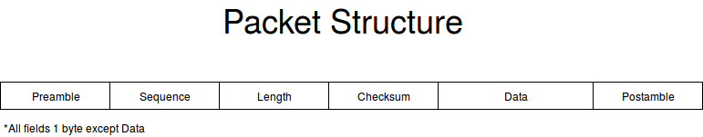

# Packet Framing

## Packet Syncronization

8-bit frame sync signal represented by 0xAA.

As seen in preliminary mesurements, we cannot assume that duty cycle is 50%, the
faster the bit rate, the skinnier the pulses. We will assume maximum bit rate of
10Kbit/s and we will use the timer module to do two things:

- Determine Transmission Rate
- Determine bit locking point

Our transmission rates are slow enough that calculations can be done for
syncronization in the last bit of syncronization. (1/10kHz = 100us);

Transmission rate is averaged from the first three pulses, and locking point is
half the average of the high time of the same pulses.

## Packet Structure

